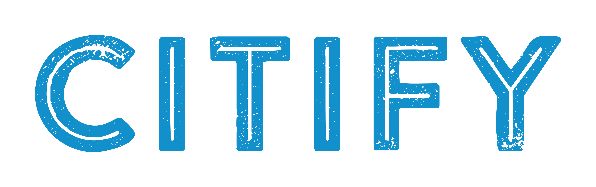

    

## Citify

This application allows users to search for any city in the United States and give their review on it.

## Technical Demonstrations
- Using docker for environment consistency through Laravel Sail.
- Providing an API layer to interact with the front-end.
- Using Vue.js and TailwindCSS.
- General REST and ORM usage.

## How to run

1. Start your Docker processes with Sail command `./vendor/bin/sail up`.
2. Start your local clientside server with `npm run dev`.
3. Setup & seed your database with `php artisan migrate --seed`.
4. Access the application at `http://localhost`.
